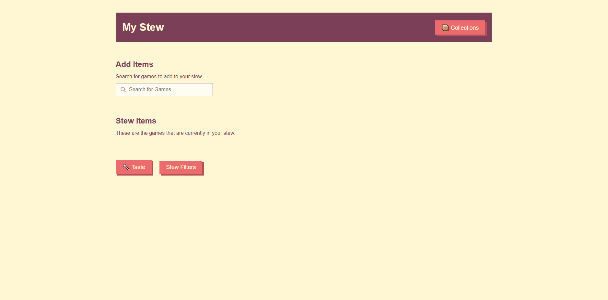
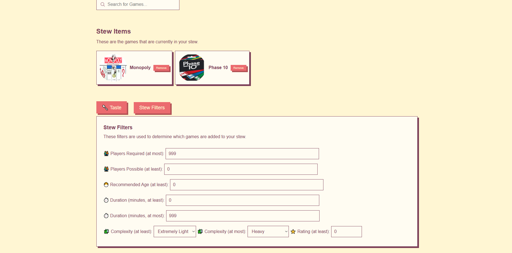
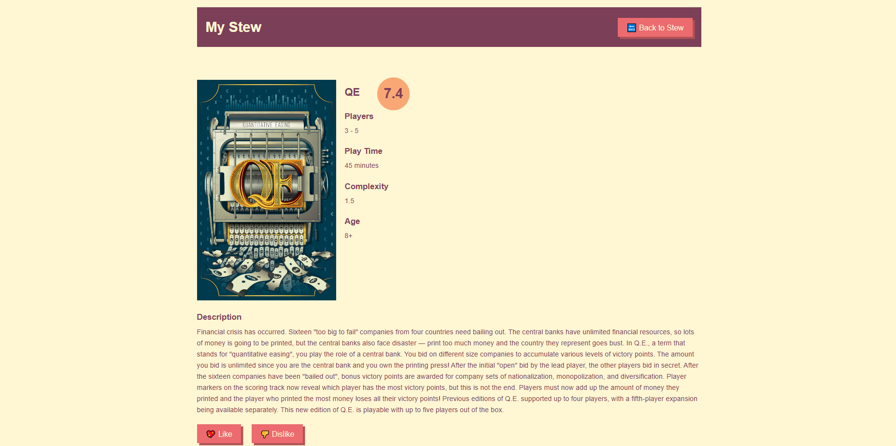
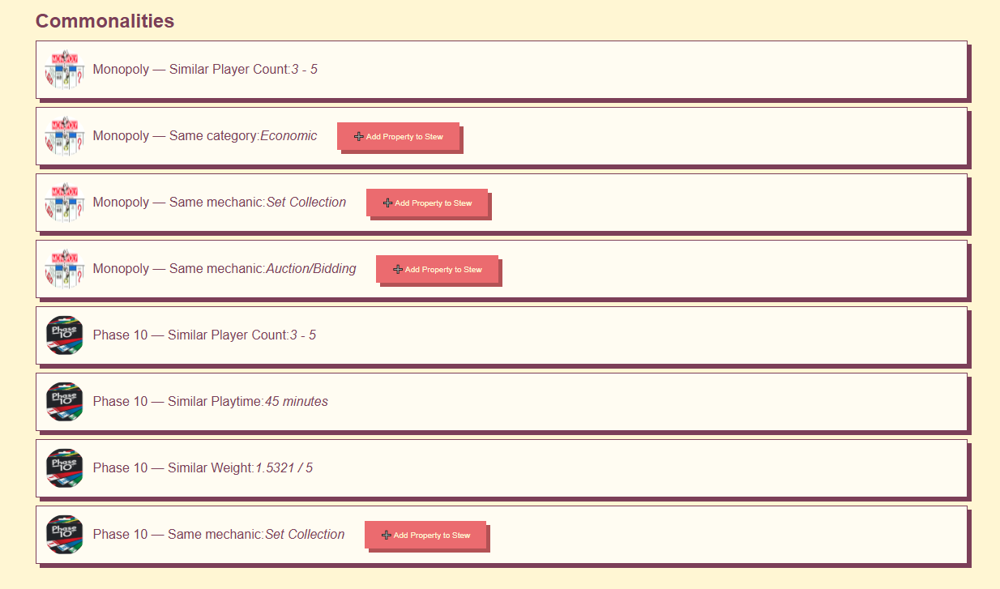
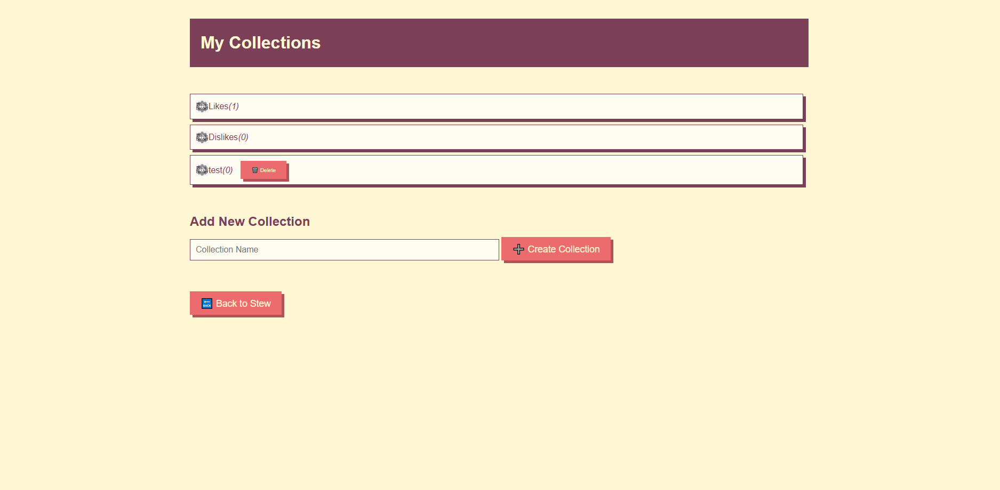
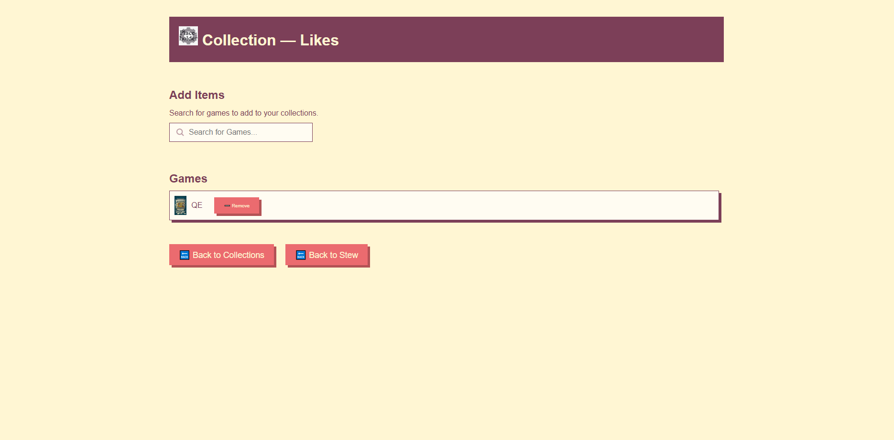

# Project Game Stew

## Team Members
- Maxim Medlyarskiy
- Jakob Harych
- Christoph Friedrich

## Problem Overview
Board game nights often default to familiar favorites like Monopoly and Catan, leaving new and potentially exciting games unplayed due to perceptions of complexity and resistance to trying something new.

## Solution
Game Stew is a web-app designed to introduce board game enthusiasts to new games by matching them with titles similar to those they already enjoy. This interactive tool simplifies the discovery process by creating a virtual "stew" of user-selected games to recommend a new, similar game.

## Key Features
- **Interactive Search:** Users can select familiar games to generate recommendations for new, similar games.
- **Customization:** The app allows users to maintain a digital record of their game collection and rate games based on specific attributes, enhancing future search accuracy.
- **User-Friendly Design:** A minimalistic and engaging interface helps mitigate decision fatigue and encourages exploration of new games.

## Objective
To broaden gaming horizons and enhance board game nights by making the discovery of new games as engaging and simple as playing a classic.

## Links
- [Class Diagram Miro Board](https://miro.com/app/board/uXjVKYY2OXE=/)
- [Style Guide](style_guide.md)

## Showcase

Homepage of the website. Allows you to search for board games to add to your stew, filter properties, and finally, taste the stew to get a recommendation. Able to access your collections from here as well.

Showcase of how it looks like when you add board games to your stew and filter properties. Multiple filter options possible, ranging from age, players required, duration and more. "Monopoly" and "Phase 10" have been added to the stew.

The recommended board game resulting from your selected board games and filters, which appears after pressing "Taste" on the homepage. In this case, the combination of "Monopoly" and "Phase 10" results in "QE". Pressing on "Like" or "Dislike" puts the game in the corresponding collection. Disliked games are being filtered out from the "taste" progress. Properties can also be disliked.

Display of the commonalities, highlighting why this game is similar to the games, filters and properties you added to the stew. Adding new properties to the stew is possible by clicking on the button.

Your collections, which you can access from the homepage. Likes and Dislikes Collection is automatically available. Adding new Collections is also possible, where you can add any board games you want inside of it, e.g. to organize specific board games.

Inside the "Like" collection. There you can manually add any board games you want with the search bar. "QE" was automatically added to the collection, because of clicking on the "Like" button displayed on the "My Stew" section. The "Dislike" collection works in the same way.